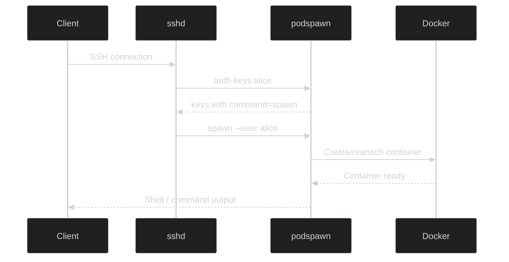

Podspawn is not an SSH server. It is a single Go binary that sshd invokes on demand -- not a daemon, not a service, not a port listener. Every SSH feature works because OpenSSH handles the protocol. Podspawn handles containers.

## The native sshd integration model

The entire server-side integration is two lines in `/etc/ssh/sshd_config`:

```
AuthorizedKeysCommand /usr/local/bin/podspawn auth-keys %u %t %k
AuthorizedKeysCommandUser nobody
```

When someone SSHes in, sshd calls `podspawn auth-keys` with the username. Podspawn reads the local key store at `/etc/podspawn/keys/<username>`. If the user exists, it returns their public keys wrapped in a `command=` directive. If not, it returns nothing and sshd falls through to normal `~/.ssh/authorized_keys` authentication.

No custom daemon. No port 2222. No TLS termination. No key exchange code.

## How AuthorizedKeysCommand works

OpenSSH's `AuthorizedKeysCommand` is a hook that runs an external program to fetch authorized keys for a user. sshd passes the connecting username as an argument and reads `authorized_keys`-format lines from stdout.

The `authkeys.Lookup` function in `internal/authkeys/authkeys.go` does the actual work:

<Steps>
<Step>Validates the username (rejects path traversal like `../` or `/`)</Step>
<Step>Opens `/etc/podspawn/keys/<username>` -- if the file doesn't exist, returns 0 keys</Step>
<Step>For each public key line, wraps it with a forced command directive</Step>
<Step>Writes the result to stdout for sshd to consume</Step>
</Steps>

Each key line returned looks like this:

```
command="/usr/local/bin/podspawn spawn --user alice",restrict,pty,agent-forwarding,port-forwarding,X11-forwarding ssh-ed25519 AAAA... alice@laptop
```

The `restrict` keyword (OpenSSH 7.4+) disables everything by default. The explicit options after it re-enable only what podspawn needs: PTY allocation, agent forwarding, port forwarding, and X11 forwarding.

<Callout type="info">
If `podspawn auth-keys` crashes or errors out, sshd simply gets no keys and proceeds with normal authentication. Real system users are never affected. The panic recovery in `cmd/auth_keys.go` ensures the process always exits cleanly.
</Callout>

## The session router

When a key matches, sshd forces `podspawn spawn --user <username>`. The session router in `internal/spawn/spawn.go` reads `SSH_ORIGINAL_COMMAND` to determine what the user is doing:

```
SSH_ORIGINAL_COMMAND=""                    --> interactive shell (PTY)
SSH_ORIGINAL_COMMAND="sftp-server"         --> SFTP subsystem
SSH_ORIGINAL_COMMAND="scp -t /path"        --> scp transfer
SSH_ORIGINAL_COMMAND="rsync --server ..."  --> rsync
SSH_ORIGINAL_COMMAND="anything else"       --> remote command execution
```

The routing logic in `routeSession` is straightforward:

- Empty command: interactive shell with TTY, SIGWINCH resize handling via `ExecIDCallback`
- SFTP detected: exec `/usr/lib/openssh/sftp-server` inside the container
- Everything else: exec `sh -c "<original command>"` inside the container

All paths pipe stdin/stdout/stderr between sshd and `docker exec`, then propagate the exit code back through `os.Exit`. Tools that check exit codes (rsync, CI scripts, VS Code) all behave correctly.

## End-to-end flow



### Session modes

Podspawn supports three session modes that control what happens when a user disconnects:

<Tabs items={['grace-period', 'destroy-on-disconnect', 'persistent']}>
<Tab value="grace-period">
The container lingers for a configurable window (default 60 seconds), then gets destroyed. Reconnecting within the window reattaches to the same container. This is the default mode.
</Tab>
<Tab value="destroy-on-disconnect">
The container is removed immediately when the SSH session ends. Designed for CI, AI agents, and environments where immediate cleanup matters.
</Tab>
<Tab value="persistent">
The container stays alive indefinitely until explicitly destroyed. Home directory is bind-mounted from `/var/lib/podspawn/homes/<user>/` so files survive container recreation.
</Tab>
</Tabs>

The mode is resolved per-container with layered precedence: server default, then user override (`/etc/podspawn/users/<username>.yaml`), then project config. See [Session Lifecycle](/docs/concepts/session-lifecycle) for the full resolution logic and cleanup behavior.

## Why zero SSH protocol code

Every custom SSH server in Go -- including ContainerSSH and anything built on `gliderlabs/ssh` or `golang.org/x/crypto/ssh` -- carries the risk of bugs in key exchange, cipher negotiation, and channel handling. CVE-2024-45337 (authentication bypass in `golang.org/x/crypto/ssh`) demonstrated this concretely.

Podspawn's architecture is immune because it never touches the SSH protocol. These features are handled entirely by sshd with zero code in podspawn:

| Feature | How sshd handles it |
|---|---|
| Port forwarding (`-L`, `-R`) | `direct-tcpip` and `tcpip-forward` channels, processed before ForceCommand |
| SOCKS proxy (`-D`) | Dynamic forwarding, native sshd feature |
| Agent forwarding (`-A`) | sshd creates socket, sets `SSH_AUTH_SOCK`; podspawn bind-mounts it |
| X11 forwarding | sshd handles protocol, sets `DISPLAY`; podspawn passes env |
| VS Code Remote SSH | SFTP for file sync + exec channels -- both routed by session router |
| JetBrains Gateway | Same as VS Code -- SFTP + exec |
| tmux/screen | Runs inside the container, works naturally |

## The Runtime interface

The `Runtime` interface in `internal/runtime/runtime.go` is the abstraction boundary between podspawn and container engines:

```go
type Runtime interface {
    ContainerExists(ctx context.Context, name string) (bool, error)
    CreateContainer(ctx context.Context, opts ContainerOpts) (string, error)
    StartContainer(ctx context.Context, id string) error
    Exec(ctx context.Context, containerID string, opts ExecOpts) (int, error)
    StopContainer(ctx context.Context, id string, timeout time.Duration) error
    RemoveContainer(ctx context.Context, id string) error
    ResizeExec(ctx context.Context, execID string, height, width uint) error
    BuildImage(ctx context.Context, buildCtx io.Reader, tag string) error
    ImageExists(ctx context.Context, ref string) (bool, error)
    CreateNetwork(ctx context.Context, name string) (string, error)
    RemoveNetwork(ctx context.Context, id string) error
    ListContainers(ctx context.Context, labelFilter map[string]string) ([]ContainerInfo, error)
    InspectContainer(ctx context.Context, id string) (*ContainerInfo, error)
}
```

Two implementations exist:

- **`DockerRuntime`** (`internal/runtime/docker.go`) -- production implementation using the Docker Go SDK (`github.com/docker/docker/client`). Handles image pulling, container lifecycle, exec with TTY/non-TTY multiplexing, network management.
- **`FakeRuntime`** (`internal/runtime/fake.go`) -- test double that records all calls for assertion. Thread-safe via `sync.Mutex`. Used by the 96+ unit tests so they run in under 2 seconds without touching Docker.

This separation is the key design decision for testability. The `spawn.Session` struct accepts any `Runtime`, so unit tests inject `FakeRuntime` and integration tests (behind `//go:build integration`) use `DockerRuntime`.

<Callout type="info">
The Runtime interface follows the Fly.io Machines pattern: creation (slow -- image pull, rootfs prep) is separated from start (fast -- subsecond). This enables future warm container pools for instant SSH-to-shell times.
</Callout>

## Process model

Podspawn's server component is not a long-running daemon. Every SSH session spawns a separate `podspawn spawn` process, invoked by sshd. Multiple processes hit the same SQLite database simultaneously, coordinated by per-user file locks at `/var/lib/podspawn/locks/<username>.lock` (see [Session Lifecycle](/docs/concepts/session-lifecycle) for details).

The only optional daemon is `podspawn cleanup --daemon`, which enforces max lifetimes and expires grace periods. It is not in the critical path -- the system self-heals without it, just with slightly delayed cleanup.

## Key paths

<Files>
<Folder name="/etc/podspawn" defaultOpen>
<File name="config.yaml" />
<Folder name="keys" defaultOpen>
<File name="&lt;username&gt;" />
</Folder>
</Folder>
<Folder name="/var/lib/podspawn" defaultOpen>
<File name="state.db" />
<Folder name="locks">
<File name="&lt;username&gt;.lock" />
</Folder>
</Folder>
<Folder name="~/.podspawn">
<File name="config.yaml" />
</Folder>
</Files>

| Path | Purpose |
|---|---|
| `/etc/podspawn/config.yaml` | Server configuration |
| `/etc/podspawn/keys/<username>` | Per-user SSH public keys |
| `/var/lib/podspawn/state.db` | SQLite session state (WAL mode) |
| `/var/lib/podspawn/locks/` | Per-user flock files |
| `~/.podspawn/config.yaml` | Client configuration |
