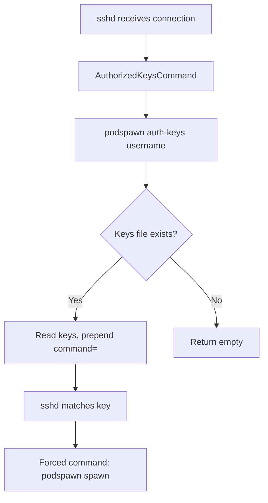
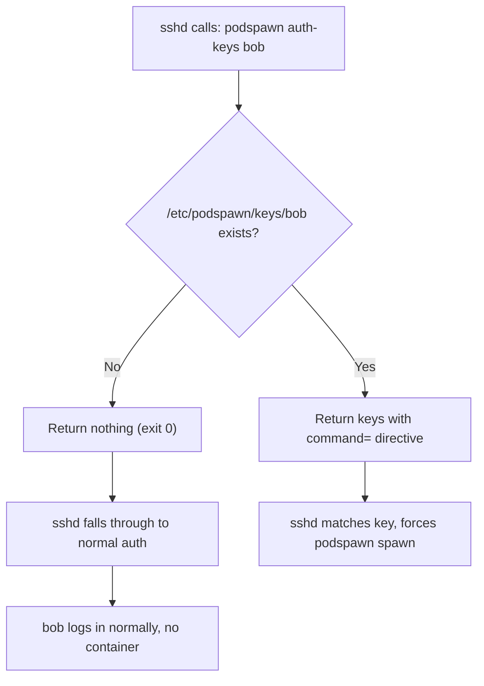

Podspawn's auth model is local-first. Keys are stored as flat files on the server. The auth path makes zero network calls. If the image is cached, the entire flow works offline.

## Local key store

<Files>
<Folder name="/etc/podspawn" defaultOpen>
<Folder name="keys" defaultOpen>
<File name="alice" />
<File name="bob" />
<File name="ci-runner" />
</Folder>
<File name="emergency.keys" />
</Folder>
</Files>

Every container user has a key file at `/etc/podspawn/keys/<username>`. Each file contains one SSH public key per line, in standard `authorized_keys` format:

```
ssh-ed25519 AAAA...key1... alice@laptop
ssh-ed25519 AAAA...key2... alice@desktop
```

Blank lines and lines starting with `#` are ignored. The directory is configured via `auth.key_dir` in `/etc/podspawn/config.yaml` (default: `/etc/podspawn/keys`).

## How keys are registered

Keys get into the local store via `podspawn add-user`:

```bash
# Paste a key directly
podspawn add-user alice --key "ssh-ed25519 AAAA..."

# From a file
podspawn add-user alice --key-file ~/.ssh/id_ed25519.pub

# Import from GitHub (one-time fetch)
podspawn add-user alice --github alice
```

<Callout type="info">
GitHub key import is a one-time operation, not a runtime dependency. The `--github` flag fetches keys from `https://github.com/<username>.keys` at registration time and writes them to `/etc/podspawn/keys/<username>`. After that, GitHub is never contacted again. If GitHub is down, existing users still authenticate normally.
</Callout>

## The auth-keys flow



When someone SSHes in, sshd invokes the `AuthorizedKeysCommand`:

```
AuthorizedKeysCommand /usr/local/bin/podspawn auth-keys %u %t %k
AuthorizedKeysCommandUser nobody
```

sshd passes `%u` (username), `%t` (key type), and `%k` (key data) as arguments. The `auth-keys` subcommand in `cmd/auth_keys.go` calls `authkeys.Lookup` which:

<Steps>
<Step>Rejects usernames containing `/` or `..` (path traversal protection)</Step>
<Step>Opens `/etc/podspawn/keys/<username>`</Step>
<Step>If the file doesn't exist, returns nothing -- zero keys, zero output</Step>
<Step>For each key line, wraps it with the forced command directive and writes to stdout</Step>
</Steps>

The output for each key looks like:

```
command="/usr/local/bin/podspawn spawn --user alice",restrict,pty,agent-forwarding,port-forwarding,X11-forwarding ssh-ed25519 AAAA... alice@laptop
```

### The `command=` directive

This is the mechanism that makes podspawn work. When sshd matches a key with a `command=` option, it ignores whatever command the user requested and runs the forced command instead. The user's original command is preserved in the `SSH_ORIGINAL_COMMAND` environment variable, which the session router reads to determine session type.

### The `restrict` keyword

`restrict` (OpenSSH 7.4+, December 2016) disables all optional SSH features by default:

- No PTY allocation
- No agent forwarding
- No port forwarding
- No X11 forwarding
- No user-rc execution

The options after `restrict` selectively re-enable what podspawn needs:

| Option | What it enables |
|---|---|
| `pty` | Terminal allocation for interactive shells |
| `agent-forwarding` | SSH agent socket passthrough to containers |
| `port-forwarding` | Local (`-L`) and remote (`-R`) port forwarding |
| `X11-forwarding` | X11 display passthrough |

This is an explicit allowlist -- any new SSH feature added in the future is disabled by default until explicitly enabled.

## How real users fall through

The key design constraint: podspawn must never interfere with normal system users. The mechanism is simple:



`authkeys.Lookup` returns 0 keys and `nil` error when the key file doesn't exist. sshd treats empty output from `AuthorizedKeysCommand` as "no keys found" and proceeds with its normal authentication chain: `AuthorizedKeysFile`, then password auth if enabled.

<Callout type="info">
The `podspawn server-setup` command verifies that `AuthorizedKeysFile` is still enabled in sshd_config before making changes. It also checks that password auth or existing keys are configured, so you cannot accidentally lock yourself out.
</Callout>

## Crash safety

The `auth-keys` command is crash-safe by design. In `cmd/auth_keys.go`:

```go
defer func() {
    if r := recover(); r != nil {
        slog.Error("auth-keys panic", "error", r)
    }
}()
```

If podspawn panics, the deferred recovery catches it and exits cleanly. sshd gets no keys and falls through to normal auth. A crash in podspawn never locks anyone out.

The binary path is resolved at runtime via `os.Executable()`, falling back to `/usr/local/bin/podspawn` if that fails. This means the `command=` directive always points to the correct binary location even if it's installed elsewhere.

## Security properties

**No network calls at auth time.** The entire auth path is a local file read. No database queries, no HTTP requests, no DNS lookups. This makes it fast (sub-millisecond) and eliminates an entire class of timeout and availability issues.

**No user enumeration.** Whether a user exists or not, `auth-keys` returns exit code 0. An attacker cannot distinguish "user doesn't exist" from "user exists but wrong key" by observing the SSH handshake.

**Path traversal protection.** Usernames containing `/` or `..` are rejected before any file system access. The validation in `authkeys.Lookup` prevents requests like `auth-keys ../../../etc/shadow`.

**Emergency fallback.** The `server-setup` command creates `/etc/podspawn/emergency.keys` -- a standard authorized_keys file that sshd reads independently of podspawn. If podspawn ever malfunctions completely, this key still works.

## Key management

Keys are plain files. Standard Unix tools work:

```bash
# List all container users
ls /etc/podspawn/keys/

# View alice's keys
cat /etc/podspawn/keys/alice

# Remove alice entirely
rm /etc/podspawn/keys/alice

# Add a key manually
echo "ssh-ed25519 AAAA..." >> /etc/podspawn/keys/alice
```

No daemon restart needed. sshd calls `auth-keys` fresh on every connection, so key changes take effect immediately.
