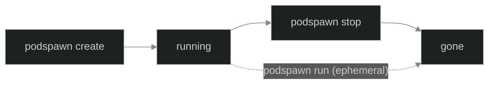
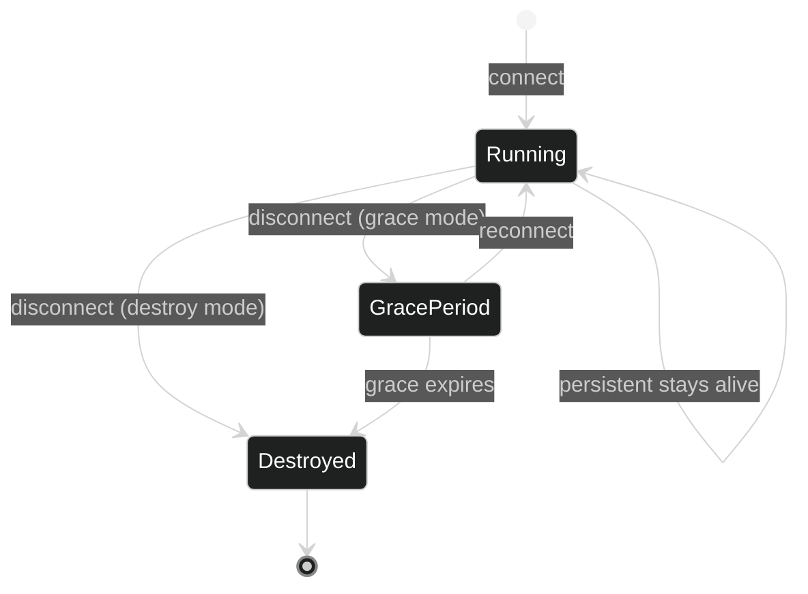
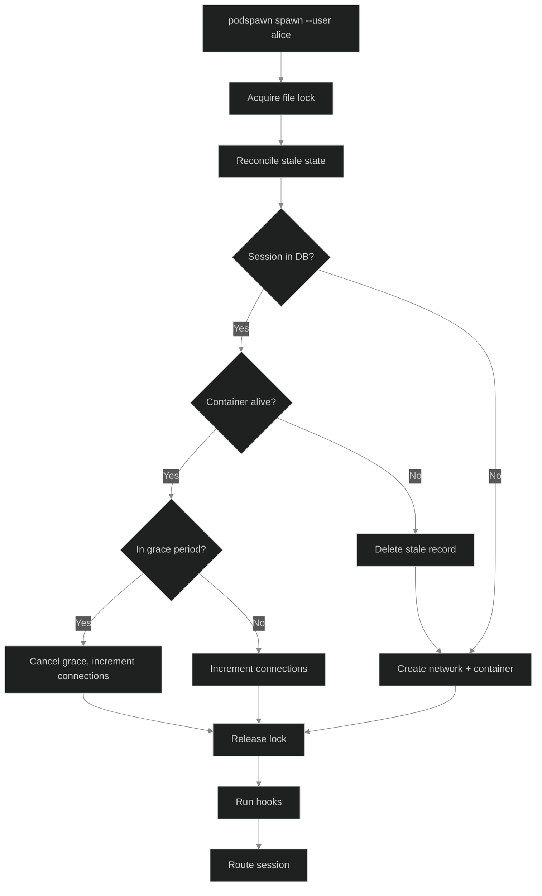
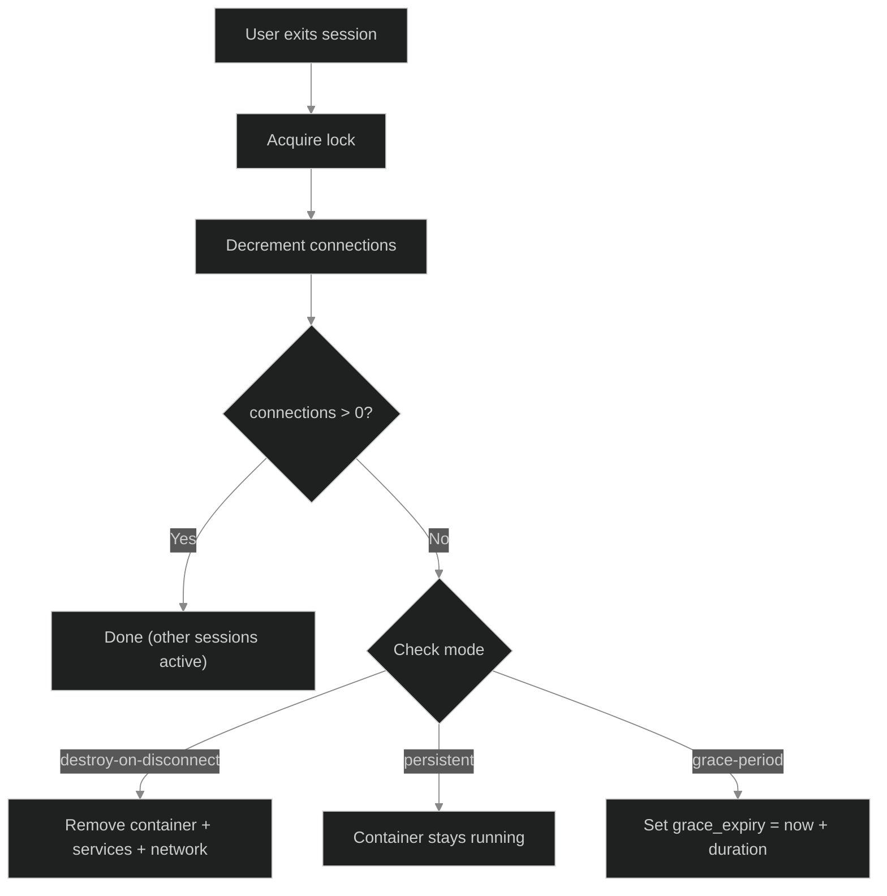

A session in podspawn maps a `(user, project)` pair to a running container. The lifecycle differs between local mode and server mode. Local mode is simpler: containers run until you stop them. Server mode adds reference-counted connections, grace periods, and automatic cleanup.

## Local mode lifecycle

In local mode, container lifecycle is manual and explicit:



There are no grace periods, no cleanup daemon, and no max lifetimes. A machine created with `podspawn create` runs until you destroy it with `podspawn stop`. A machine created with `podspawn run` is ephemeral and destroys itself when you exit the shell.

### Idle containers

A container sitting idle (no shell attached) runs `sleep infinity` as PID 1. The actual resource cost:

| Resource | Idle cost | Notes |
|----------|-----------|-------|
| CPU | ~0% | `sleep infinity` makes a single syscall and blocks forever |
| Memory | 5-15 MB | Kernel overhead for the container's namespaces, cgroups, and the sleep process |
| Disk | 0 | No writes unless you left something running inside |

For comparison, a browser tab uses 50-300 MB. An idle podspawn container is negligible on a laptop.

### Why not pause?

Docker supports `docker pause`, which sends SIGSTOP to freeze all processes. It sounds like it would help, but:

- **It doesn't free memory.** Paused containers keep their full memory allocation. The only resource it saves is CPU, which is already ~0% for a sleeping container.
- **It breaks expectations.** A paused container can't respond to `docker exec`, so `podspawn shell` would need to unpause first, adding latency and failure modes for no real benefit.
- **`docker stop` frees memory but costs startup time.** Stopping a container releases everything, but restarting takes 1-2 seconds and loses any running background processes. This tradeoff makes sense on servers with many users, not on a laptop with one or two containers.

If you're done for the day, `podspawn stop` is the right call. If you're switching between tasks, leave it running. The cost is not worth optimizing.

### When to stop machines

| Situation | Recommendation |
|-----------|---------------|
| Switching to a different project for an hour | Leave it running |
| Done for the day | `podspawn stop` or leave it, either is fine |
| Low on memory (running heavy local processes) | `podspawn stop` to reclaim the memory limit |
| Docker restart / system reboot | Containers are destroyed automatically |

## Server mode lifecycle



In server mode, lifecycle is automatic. When a user runs `ssh user@project.pod`, podspawn either creates a new container or reattaches to an existing one. When she disconnects, the container enters a grace period. When the grace period expires, the container and all its companion services are destroyed.

## Session state

Sessions are tracked in SQLite at `/var/lib/podspawn/state.db`. The `state.Session` struct in `internal/state/state.go` holds:

| Field | Purpose |
|---|---|
| `User` + `Project` | Composite primary key. `work.pod` and `playground.pod` create separate sessions for the same user. |
| `ContainerID` / `ContainerName` | Docker container identifiers. Name follows `podspawn-<user>-<project>` pattern. |
| `Status` | `running` or `grace_period` |
| `Connections` | Reference count of active SSH sessions attached to this container |
| `GraceExpiry` | When the grace period ends (null when status is `running`) |
| `MaxLifetime` | Hard deadline regardless of activity |
| `NetworkID` | Per-user Docker bridge network |
| `ServiceIDs` | Comma-separated companion service container IDs |

The database uses WAL mode and a 5-second busy timeout for concurrent access:

```sql
PRAGMA journal_mode=WAL;
PRAGMA busy_timeout=5000;
```

## The connect flow

When `podspawn spawn` runs, `ensureContainerWithState` in `internal/spawn/spawn.go` executes under an exclusive per-user file lock:



The file lock at `/var/lib/podspawn/locks/<username>.lock` prevents the check-then-create race: two SSH sessions arriving simultaneously for the same user both see "no container" and both try to create one. The lock serializes them so the second session reattaches to the container the first one created.

<Callout type="info">
Locks are per-user, not global. Alice's lock never blocks Bob's session creation. The lock implementation uses `syscall.Flock` in `internal/lock/lock.go`, which works across processes on the same host.
</Callout>

## Reference-counted connections

Multiple SSH sessions to the same `(user, project)` share one container. The `Connections` field tracks how many:

```
Terminal 1: ssh alice@work.pod   --> connections = 1
Terminal 2: ssh alice@work.pod   --> connections = 2
Terminal 1: exit                 --> connections = 1 (container stays)
Terminal 2: exit                 --> connections = 0 (grace period starts)
```

Each `UpdateConnections` call is atomic -- a single SQL statement with `RETURNING`:

```sql
UPDATE sessions SET connections = MAX(0, connections + ?), last_activity = ?
WHERE user = ? AND project = ? RETURNING connections;
```

The `MAX(0, ...)` guard prevents the count from going negative if something goes wrong.

## The disconnect flow

`Session.Disconnect` in `internal/spawn/spawn.go` handles teardown:



`RunAndCleanup` wraps the full lifecycle: run the session, then call `Disconnect` with a 10-second timeout context for cleanup.

## Grace periods

The default grace period is 60 seconds, configured at `session.grace_period` in `/etc/podspawn/config.yaml`. During this window:

- The container keeps running
- A new SSH connection cancels the grace period and reattaches
- Network blips, accidental disconnects, and SSH reconnects all land back in the same container

When the grace period expires, the container and all companion services are destroyed. Expiry is enforced in two ways:

1. **On next connect** -- `reconcileUser` checks if the grace period has passed and cleans up before creating a new container
2. **By the cleanup daemon** -- `podspawn cleanup --daemon` polls `ExpiredGracePeriods()` every 60 seconds and removes expired sessions

## Destroy-on-disconnect mode

For CI pipelines and AI agents that need immediate cleanup, set `session.mode: "destroy-on-disconnect"` in config. This sets zero grace period -- the container is removed the instant the last connection drops.

Alternatively, set `session.grace_period: "0s"` with any mode for the same effect.

## Persistent mode

Persistent mode keeps the container alive indefinitely after disconnect. There is no grace period countdown and no max lifetime enforcement. The container runs until it is explicitly stopped or the host restarts.

Set `session.mode: "persistent"` in config:

```yaml
# /etc/podspawn/config.yaml
session:
  mode: "persistent"
```

### Home directory bind mount

Persistent sessions bind-mount the user's home directory from the host at `/var/lib/podspawn/homes/<username>/`. This means files written to `$HOME` inside the container survive container recreation. If the container is stopped, upgraded to a new image, or destroyed by a host reboot, the home directory is still on disk and gets mounted back into the next session.

```
/var/lib/podspawn/homes/alice/   <-->   /home/alice (inside container)
```

The directory is created on first session if it does not exist, owned by the container user's UID.

<Callout type="info">
The bind mount only covers the home directory. System-level changes (installed packages, modified config files outside `$HOME`) are still lost when the container is recreated. Use a Podfile to declaratively install packages that should persist across container rebuilds.
</Callout>

### Cleanup daemon behavior

The cleanup daemon skips persistent containers entirely. It does not check them for grace period expiry or max lifetime violations. Persistent sessions only appear in cleanup if the container is gone from Docker but the session record remains in the database, in which case normal reconciliation removes the stale record.

### When to use persistent mode

Persistent mode is designed for long-lived development environments where the cost of recreating state (shell history, caches, editor configs, compiled artifacts) outweighs the cost of leaving a container running. It trades automatic resource reclamation for developer convenience.

If you want the container to stop after disconnect but keep the home directory for next time, persistent mode is still the right choice. Run `podspawn stop` manually when you are done. The bind-mounted home directory survives the stop.

## Max lifetimes

Every session has a hard deadline: `max_lifetime` (default 8 hours). When `time.Now()` passes `MaxLifetime`, the session is eligible for destruction regardless of active connections or grace period status. Persistent sessions are exempt from max lifetime enforcement.

The cleanup daemon enforces this via `ExpiredLifetimes()`:

```sql
SELECT ... FROM sessions WHERE max_lifetime < ? AND mode != 'persistent'
```

This prevents zombie containers from users who leave SSH sessions open indefinitely.

## Reconciliation

Podspawn is self-healing. On every `spawn` invocation, `reconcileUser` checks for two kinds of stale state:

1. **Stale zero-connection sessions** -- `connections = 0` with no grace expiry set. This happens when podspawn crashes between decrementing the connection count and setting the grace period. The `StaleZeroConnections` query catches these.

2. **Expired grace periods** -- sessions where `grace_expiry` has passed. If the cleanup daemon isn't running, the next connection triggers cleanup.

If a container exists in the DB but Docker reports it gone, the session record is deleted. If a container exists in Docker with `managed-by=podspawn` labels but not in the DB, `podspawn cleanup` destroys it.

## Session destruction

When a session is destroyed (grace expiry, max lifetime, or destroy-on-disconnect), cleanup is atomic in `cleanupSessionResources`:

1. Remove the dev container (`RemoveContainer` with force)
2. Stop and remove all companion service containers (postgres, redis, etc.)
3. Remove the per-user Docker network

If any step fails, the next `spawn` invocation's reconciliation catches the orphan. No manual intervention needed.

## Mode resolution order

When podspawn determines which session mode to use, it checks three levels of configuration in order, with later levels overriding earlier ones:

<Steps>
<Step>**Server default** -- `session.mode` in `/etc/podspawn/config.yaml`</Step>
<Step>**User override** -- `session.mode` in `/etc/podspawn/users/<username>.yaml`</Step>
<Step>**Project config** -- `session.mode` in the project's Podfile (highest priority)</Step>
</Steps>

This means a server admin can set `destroy-on-disconnect` as the default, while a specific user can override to `persistent` for their own sessions, and a specific project can override further if needed.

## Configuration reference

```yaml
# /etc/podspawn/config.yaml
session:
  grace_period: "60s"       # how long containers survive after last disconnect
  max_lifetime: "8h"        # hard limit regardless of activity (ignored for persistent)
  mode: "grace-period"      # "grace-period" | "destroy-on-disconnect" | "persistent"
```

## Session modes summary

<Tabs items={['grace-period (default)', 'destroy-on-disconnect', 'persistent']}>
<Tab value="grace-period (default)">
- **Grace period:** Configurable, default 60s
- **Max lifetime:** Enforced, default 8h
- **Home bind mount:** No
- **Use case:** Human developers. Survives network blips, accidental disconnects, and SSH reconnects.
</Tab>
<Tab value="destroy-on-disconnect">
- **Grace period:** Zero
- **Max lifetime:** Enforced, default 8h
- **Home bind mount:** No
- **Use case:** CI, AI agents. Immediate cleanup, no billing surprises.
</Tab>
<Tab value="persistent">
- **Grace period:** None, container stays alive
- **Max lifetime:** Exempt
- **Home bind mount:** Yes, from `/var/lib/podspawn/homes/<user>/`
- **Use case:** Long-lived dev environments. Files survive container recreation.
</Tab>
</Tabs>
