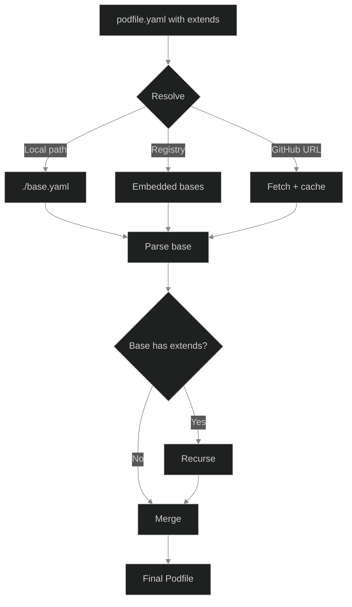

The `extends` field lets a Podfile inherit from a base, then customize on top. This avoids duplicating common setup across repos.

## Basic usage

```yaml
extends: ubuntu-dev
packages: [go@1.24, make]
on_create: go mod download
```

This inherits everything from the `ubuntu-dev` base (git, curl, ripgrep, fzf, neovim, jq, etc.) and adds Go on top.

## Resolution order



The `extends` value is resolved by trying each source in order until one matches:

<Tabs items={['Local file path', 'Registry shorthand', 'GitHub URL']}>
  <Tab value="Local file path">
    Relative or absolute paths to a YAML file on disk.

    ```yaml
    extends: ./base/podfile.yaml
    extends: /absolute/path.yaml
    ```

    Checked first. Use this for monorepos or local base files that live alongside your project.
  </Tab>
  <Tab value="Registry shorthand">
    A short name that maps to a base in the embedded registry or cached bases.

    ```yaml
    extends: ubuntu-dev
    extends: minimal
    ```

    Podspawn checks embedded bases first, then `~/.podspawn/cache/podfiles/`. Run `podspawn init --update` to refresh cached bases.
  </Tab>
  <Tab value="GitHub URL">
    A full path to a YAML file hosted on GitHub.

    ```yaml
    extends: github.com/myorg/podfiles/go-base.yaml
    ```

    Fetched over HTTPS and cached locally. Useful for org-wide bases shared across many repos.
  </Tab>
</Tabs>

### Available bases

| Name | Description |
|------|-------------|
| `ubuntu-dev` | Ubuntu 24.04 + git, curl, ripgrep, fzf, neovim, jq, htop, make |
| `minimal` | Ubuntu 24.04 + git, curl |

See the full list at [podspawn/podfiles](https://github.com/podspawn/podfiles).

## Merge semantics

When a child Podfile extends a base, fields are merged according to their type:

| Field type | Merge behavior |
|-----------|---------------|
| Scalars (`base`, `shell`, `mount`, `mode`) | Child wins if non-empty |
| `packages`, `extra_commands` | Child appends to base, duplicates removed. `"!item"` removes from base. |
| `services` | Same-name: child replaces the service. Different name: appended. `"!name"` removes. |
| `repos` | Same-URL: child overrides branch/path. Different URL: appended. `"!url"` removes. |
| `env` | Merge maps, child wins on key conflict. Empty value `""` removes the key. |
| `on_create`, `on_start` | Concatenate: base runs first, then child |
| `dotfiles` | Child replaces entirely if set (not per-field) |
| `resources` | Per-field: `cpus` and `memory` override independently |
| `ports.expose` | Append and deduplicate (no bang-replace support) |

### Example

Base (`ubuntu-dev`):
```yaml
base: ubuntu:24.04
packages: [git, curl, ripgrep, fzf, neovim, jq]
shell: /bin/bash
```

Child:
```yaml
extends: ubuntu-dev
packages: [go@1.24]
shell: /bin/zsh
on_create: go mod download
```

Result:
```yaml
base: ubuntu:24.04
packages: [git, curl, ripgrep, fzf, neovim, jq, go@1.24]
shell: /bin/zsh
on_create: go mod download
```

<Accordions>
  <Accordion title="Bang-replace syntax: replacing entire fields">
    To fully replace a base field instead of merging, use the `!` suffix on the YAML key:

    ```yaml
    extends: ubuntu-dev
    packages!: [only-this-package]
    env!:
      CLEAN: slate
    on_create!: |
      completely-replace-base-hooks
    ```

    This works for `packages!`, `env!`, `services!`, `repos!`, `extra_commands!`, `on_create!`, and `on_start!`.

    Without the `!` suffix, these fields would merge with the base. With it, the base values are discarded entirely.
  </Accordion>
  <Accordion title="Item-level removal: removing specific entries">
    Remove specific items from a base list by prefixing with `!` (quoted):

    ```yaml
    extends: ubuntu-dev
    packages:
      - "!neovim"
      - "!htop"
      - go@1.24
    ```

    Result: everything from ubuntu-dev except neovim and htop, plus go. The `!` prefix must be quoted because `!` is special in YAML.

    Same pattern works for services (by name) and repos (by URL):

    ```yaml
    services:
      - name: "!redis"
    ```
  </Accordion>
</Accordions>

## Multi-level extends

Extends chains are resolved recursively:

```yaml
# grandparent.yaml
base: ubuntu:24.04
packages: [git]

# parent.yaml
extends: ./grandparent.yaml
packages: [go]

# child podfile.yaml
extends: ./parent.yaml
packages: [npm]
# result: packages = [git, go, npm]
```

<Callout type="warn">
Maximum chain depth is 10. Circular references are detected and rejected.
</Callout>

## Building org-wide bases

For organizations with many repos sharing common tooling:

1. Create a base Podfile in a shared repo or as a local file
2. Reference it from each project's Podfile via `extends`
3. Changes to the base automatically propagate (image hash changes trigger rebuilds)

```yaml
# In each project
extends: github.com/myorg/podfiles/go-base.yaml
packages: [project-specific-tool]
```
